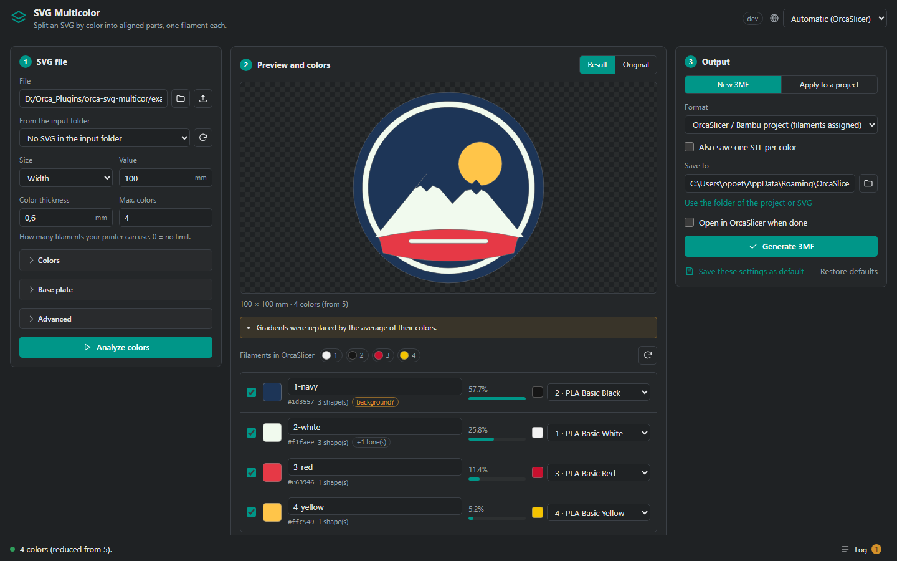

# SVG Multicolor for OrcaSlicer

[](https://github.com/opoeta/orca-svg-multicor/actions/workflows/ci.yml)
[](LICENSE)
[](https://github.com/opoeta/orca-svg-multicor/releases/latest)

**[Leia em português](README.pt-BR.md)**

An OrcaSlicer plugin that turns a multicolor SVG (a logo, a sign, a sticker design)
into **one printable part per color**, all aligned in the same frame and already
assigned to your filaments.



## What it does

- **New 3MF**: one object with one part per color, named and assigned to a
  filament, optionally on top of a **base plate** (following the outline, or a
  rounded rectangle). Opens in OrcaSlicer / Bambu Studio ready to slice. A
  standard 3MF (with colors) is also available for other slicers, plus one STL
  per color.
- **Apply to a project**: adds the colors as new parts of an object in a saved
  project, centered on its top face, **inlaid** (same height, the top layers
  change color) or **raised**. Works with the projects OrcaSlicer and Bambu
  Studio save today. The original project is never overwritten.
- **Sees the SVG like a browser does**: shapes painted later cover earlier
  ones, so the parts fit together instead of overlapping; fill rules
  (nonzero / evenodd) are exact; outlines (strokes) become printable areas;
  gradients use the average of their colors; hidden and fully transparent
  shapes are skipped; CSS classes, `<use>`, transforms and physical units
  (`width="80mm"`) are understood.
- **Fits your printer**: limits the number of colors to your filaments by
  merging the least significant ones into the most similar (CIEDE2000),
  merges near-identical tones, and can hand details thinner than the nozzle to
  the neighboring color.
- **Reads your filaments** from OrcaSlicer and matches each color to the closest
  one. Live preview, per-color names, filaments and on/off switches.
- **13 languages**, following OrcaSlicer's language automatically: English,
  Português (Brasil), Español, Français, Deutsch, Italiano, Polski, Türkçe,
  Русский, Українська, 简体中文, 日本語, 한국어.

## Installing

1. Download `orca_svg_multicor-<version>-py3-none-any.whl` from the
   [latest release](https://github.com/opoeta/orca-svg-multicor/releases/latest).
2. In OrcaSlicer, open the **Plugins** dialog and install the `.whl` file as a
   local plugin. OrcaSlicer installs the dependencies (numpy, shapely,
   svgelements, mapbox-earcut) by itself.
3. Enable the plugin. Three capabilities appear:
   - **SVG Multicolor**: the panel, as a page inside OrcaSlicer;
   - **SVG Multicolor - window**: the same panel in its own window (heavy work
     runs in the background, OrcaSlicer stays responsive);
   - **SVG Multicolor - batch**: converts every SVG of the input folder with the
     saved settings, no interface.

> **Upgrading from 2.x**: remove the old plugin first. Both versions use the same
> Python package name and cannot be loaded side by side.

Requires an OrcaSlicer build with Python plugin support.

## Using it

1. **Choose the SVG** (Browse, a path, a copy uploaded from the page, or a file
   in the input folder). The analysis runs by itself.
2. **Check the colors** in the preview. Hover a row to highlight that color.
   Rename parts, untick what you do not want (a plain background, for example;
   colors that span the whole drawing are tagged *background?*), and pick the
   filament of each color, or let *Match filaments by color* do it.
3. **Output**:
   - *New 3MF*: choose the format and the folder, then **Generate 3MF**.
   - *Apply to a project*: save your project in OrcaSlicer (Ctrl+S), click
     **Use the project open in OrcaSlicer** (or pick a `.3mf`), choose the
     object and the placement, then **Apply to the object**, and open the
     resulting `*_svg.3mf`.

Tick *Open in OrcaSlicer when done* to open the result right away.
*Save these settings as default* keeps your choices for next time.

### Settings

| Setting | Meaning |
| --- | --- |
| Size | Width, height, or the SVG's own physical size |
| Color thickness | Height of the color parts (mm) |
| Max. colors | Merge colors down to this number (0 = no limit) |
| Merge similar tones | Joins colors closer than this ΔE (0 = off) |
| Include outlines | Turns strokes into printable areas |
| Base plate | Thickness (0 = none), margin, shape and filament |
| Precision | Simplification tolerance (mm) |
| Ignore specks under | Drops islands and holes smaller than this area (mm²) |
| Remove details thinner than | Hands unprintable slivers to the neighboring color (0 = off) |

### Good to know

- **Text** must be converted to paths (outlines) in your editor; **bitmap
  images** are ignored; **clipping paths and masks** are ignored (release them
  if shapes show up where they should not). The panel warns about all of these.
- The **native file dialogs** run as a separate process (PowerShell on Windows,
  `osascript` on macOS, `zenity`/`kdialog` on Linux). OrcaSlicer asks once
  whether the plugin may start a process; if you say no, use the upload buttons
  instead.
- Inlaying relies on OrcaSlicer giving parts added later priority where parts
  overlap, the same mechanism used when you add a part inside an object by hand.
- Files live in `<OrcaSlicer data folder>/svg_multicor/` (input, output and
  `plugin.log`). Both folders can be changed in the panel or in the Config tab.

## Adding a language

Copy `src/orca_svg_multicor/locales/en.json` to `<code>.json` (the code
OrcaSlicer uses, such as `nl` or `zh_TW`), translate the values, keep every
`{placeholder}`, set `_meta.name` to the language's own name, and run the tests.
See [CONTRIBUTING.md](CONTRIBUTING.md).

## Development

```bash
python -m venv .venv
.venv/bin/pip install -e . -r requirements-dev.txt   # Windows: .venv\Scripts\pip
.venv/bin/pytest
python tools/dev_server.py --lang pt_BR   # the panel in your browser, real engine, fake host
python -m build --wheel                   # dist/orca_svg_multicor-<version>-py3-none-any.whl
```

The code is split so that everything except `capabilities.py` runs without
OrcaSlicer:

| Module | Role |
| --- | --- |
| `svgread.py` | SVG → ordered paint operations (fills and strokes) |
| `geometry.py` | fill rules, occlusion, cleanup, base plate, preview |
| `colors.py` | CIEDE2000, naming, merging and reducing colors, filament matching |
| `mesh.py` | extrusion, watertightness check, STL |
| `threemf.py` | OrcaSlicer/Bambu project layout and standard 3MF writers |
| `project3mf.py` | reading and editing saved projects |
| `engine.py` | analyze / generate / apply pipeline |
| `service.py` | messages between the page and the engine, translated |
| `host.py` | OrcaSlicer host API, native pickers, log |
| `capabilities.py` | the OrcaSlicer capabilities |
| `ui/` | the panel (HTML, CSS, JS; no external resources) |

## Credits

Created by Israel Fernandes. Released under the [MIT license](LICENSE).
