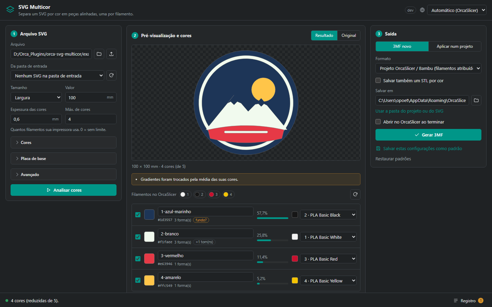

# SVG Multicor para OrcaSlicer

**[Read in English](README.md)**

Plugin do OrcaSlicer que transforma um SVG colorido (logo, placa, adesivo) em
**uma peça imprimível por cor**, todas alinhadas no mesmo referencial e já
atribuídas aos seus filamentos.

## O que ele faz

- **3MF novo**: um objeto com uma peça por cor, com nome e filamento, opcionalmente
  sobre uma **placa de base** (seguindo o contorno ou em retângulo
  arredondado). Abre no OrcaSlicer / Bambu Studio pronto para fatiar. Também gera
  3MF padrão (com cores) para outros fatiadores e um STL por cor.
- **Aplicar num projeto**: acrescenta as cores como novas peças de um objeto de
  um projeto salvo, centradas na face superior, **embutidas** (mesma altura, as
  últimas camadas trocam de cor) ou **em relevo**. Funciona com os projetos que o
  OrcaSlicer e o Bambu Studio salvam hoje. O projeto original nunca é
  sobrescrito.
- **Enxerga o SVG como o navegador**: o que é pintado depois cobre o que veio
  antes, então as peças se encaixam em vez de se sobreporem; as regras de
  preenchimento (nonzero / evenodd) são exatas; contornos (stroke) viram áreas
  imprimíveis; gradientes usam a média das cores; formas ocultas ou totalmente
  transparentes são ignoradas; entende classes CSS, `<use>`, transformações e
  unidades físicas (`width="80mm"`).
- **Cabe na sua impressora**: limita o número de cores aos seus filamentos
  juntando as menos importantes na mais parecida (CIEDE2000), junta tons quase
  iguais e pode passar detalhes mais finos que o bico para a cor vizinha.
- **Lê os filamentos** do OrcaSlicer e casa cada cor com o mais próximo.
  Pré-visualização ao vivo, nome, filamento e liga/desliga por cor.
- **13 idiomas**, seguindo o idioma do OrcaSlicer automaticamente.

## Instalação

1. Baixe `orca_svg_multicor-<versão>-py3-none-any.whl` na
   [última versão](https://github.com/opoeta/orca-svg-multicor/releases/latest).
2. No OrcaSlicer, abra a janela de **Plugins** e instale o `.whl` como plugin
   local. O OrcaSlicer instala as dependências (numpy, shapely, svgelements,
   mapbox-earcut) sozinho.
3. Ative o plugin. Aparecem três capacidades:
   - **SVG Multicolor**: o painel, como página dentro do OrcaSlicer;
   - **SVG Multicolor - window**: o mesmo painel numa janela (o trabalho pesado
     roda em segundo plano e o OrcaSlicer não trava);
   - **SVG Multicolor - batch**: converte todos os SVGs da pasta de entrada com
     as configurações salvas, sem interface.

> **Atualizando da 2.x**: remova o plugin antigo antes. As duas versões usam o
> mesmo nome de pacote Python e não podem ser carregadas juntas.

## Como usar

1. **Escolha o SVG** (Procurar, um caminho, uma cópia enviada pela página ou um
   arquivo da pasta de entrada). A análise roda sozinha.
2. **Confira as cores** na pré-visualização. Passe o mouse numa linha para
   destacar a cor. Renomeie as peças, desmarque o que não quer (um fundo, por
   exemplo; cores que ocupam o desenho inteiro recebem a etiqueta *fundo?*) e
   escolha o filamento de cada cor, ou deixe o *Casar filamentos pela cor* fazer
   isso.
3. **Saída**:
   - *3MF novo*: escolha o formato e a pasta e clique em **Gerar 3MF**.
   - *Aplicar num projeto*: salve o projeto no OrcaSlicer (Ctrl+S), clique em
     **Usar o projeto aberto no OrcaSlicer** (ou escolha um `.3mf`), escolha o
     objeto e o encaixe, clique em **Aplicar no objeto** e abra o
     `*_svg.3mf` gerado.

Marque *Abrir no OrcaSlicer ao terminar* para abrir o resultado na hora.
*Salvar estas configurações como padrão* guarda suas escolhas.

### Bom saber

- **Texto** precisa ser convertido em curvas no editor; **imagens bitmap** são
  ignoradas; **máscaras e recortes** são ignorados. O painel avisa sobre tudo
  isso.
- As **janelas nativas de seleção** rodam como processo separado (PowerShell no
  Windows). O OrcaSlicer pergunta uma vez se o plugin pode iniciar um processo;
  se você negar, use os botões de enviar arquivo.
- A janela de **Plugins do OrcaSlicer só mostra imagem de prévia e changelog
  para plugins instalados pela OrcaCloud**; num `.whl` local os dois ficam
  vazios por projeto do Orca. Veja [docs/orcacloud](docs/orcacloud/README.md)
  para publicar lá. O changelog também está em [CHANGELOG.md](CHANGELOG.md).
- Se o OrcaSlicer perguntar se o plugin pode abrir um evento "open" ou iniciar
  um processo ao usar "Procurar…", pode responder Sim: é a janela nativa de
  seleção de arquivos.
- Os arquivos ficam em `<pasta de dados do OrcaSlicer>/svg_multicor/`
  (entrada, saída e `plugin.log`).

## Créditos

Criado por Israel Fernandes. Licença [MIT](LICENSE).
